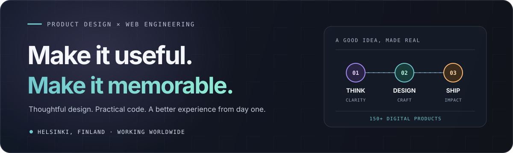
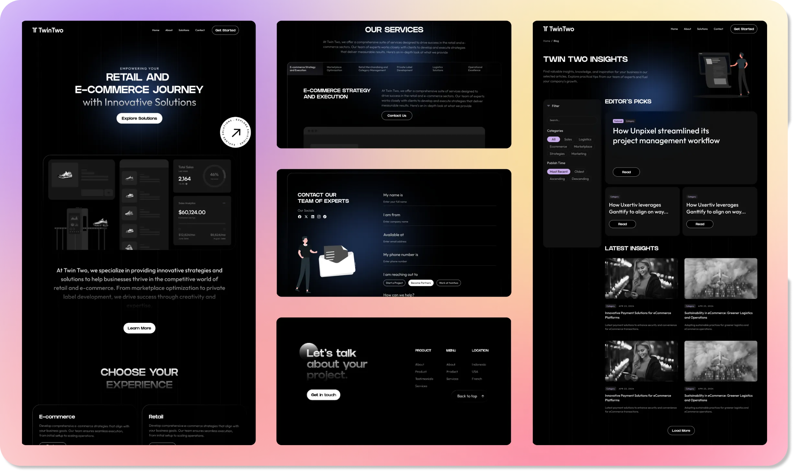
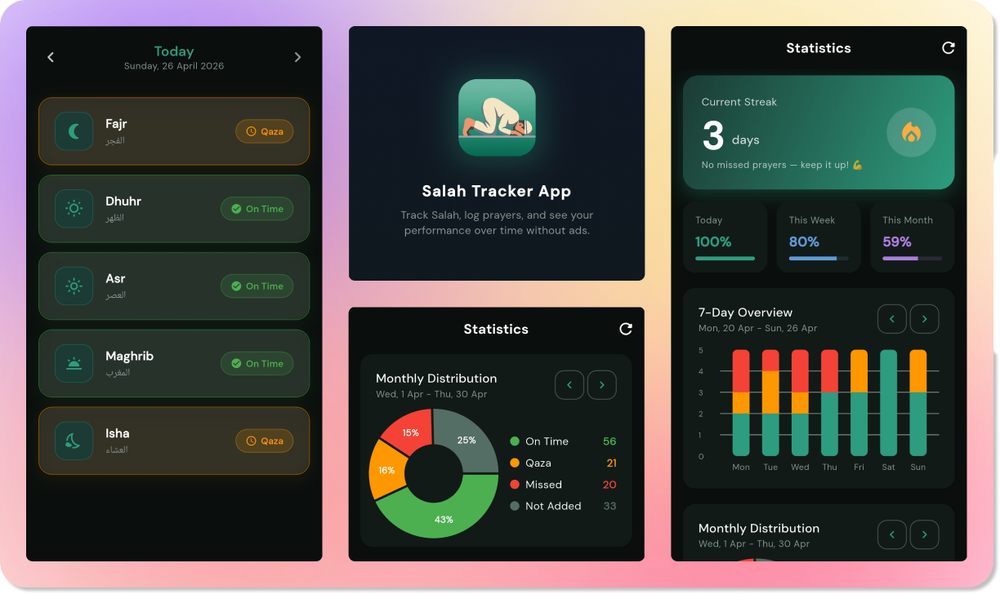
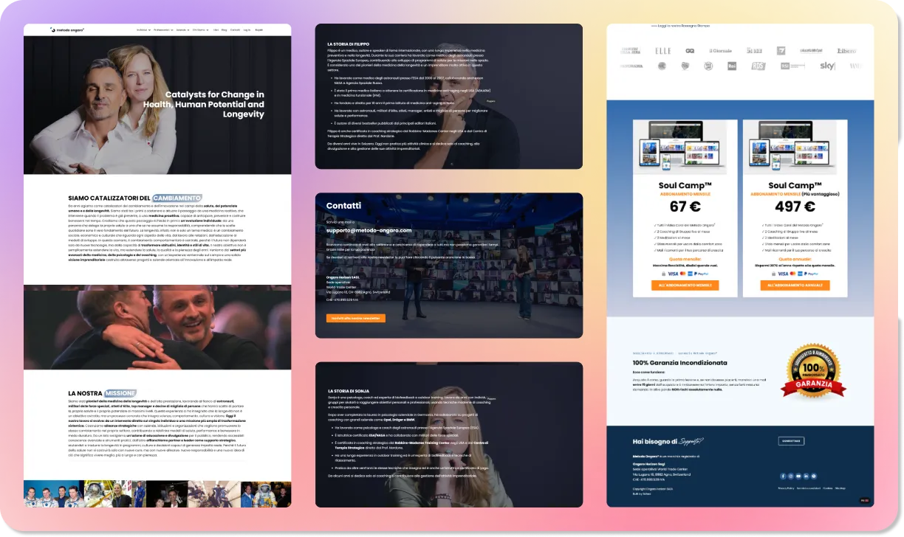

  

  <a href="https://sahedalomsumit.com/work">Explore my work ↗</a>
  &nbsp;·&nbsp;
  <a href="https://www.linkedin.com/in/sahedalomsumit/">Connect on LinkedIn ↗</a>
  &nbsp;·&nbsp;
  <a href="mailto:sahedalomsumit@gmail.com">Start a conversation ↗</a>

### I turn ambitious ideas into digital products people love using.

I’m Sahed, a Helsinki-based product designer and AI-enhanced web developer. I bring product thinking, visual craft, and code together to make digital experiences clear, useful, and a little more delightful.

**150+ digital products** · **5+ years** designing and building · **Helsinki, Finland**

### One idea. Three connected disciplines.

| **Think** | **Design** | **Build** |
|:--|:--|:--|
| Find the real problem and make the next step clear. | Shape the experience, interface, and system in Figma. | Turn it into a fast, polished product that works in the real world. |

### A few things I’ve helped bring to life

<table>
  <tr>
    <td align="center" width="33%">
       
      <strong>Twin Two</strong> Retail &amp; e-commerce
    </td>
    <td align="center" width="33%">
       
      <strong>Salah Tracker</strong> Prayer time tracking app
    </td>
    <td align="center" width="33%">
       
      <strong>Metodo Ongaro</strong> Health &amp; longevity
    </td>
  </tr>
</table>

<a href="https://sahedalomsumit.com/work"><strong>See more works of mine →</strong></a>

### Tools I reach for

Figma · React · Supabase · Webflow · Framer · WordPress · Sanity · AI-assisted workflows

Good work starts with a good conversation. I’m open to select projects worldwide.

